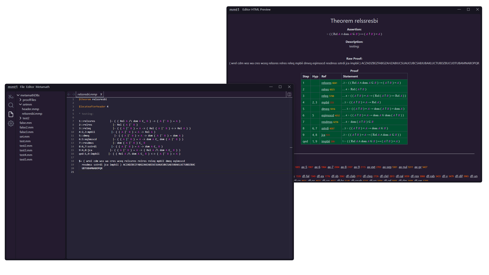

If you are reading this message then that means that mmt1 is not yet officially released and that I am still testing things. Please ignore this repository for now and come back in a few hours.

# mmt1

mmt1 is a mmj2 style proof assistant for the metamath formal language, created using [Tauri 2.0](https://v2.tauri.app). With it you can create not just metamath proofs, but also entire (grammatical) metamath databases.

## Installation

## Features

- A build in theorem explorer: Including all the features you know from the web pages: Such as axiom/definition dependencies, references, indention, theorem numbers, etc.
- A mmj2 style proof assistant: mmj2s unifier returns. The two big differences being an updated header syntax (similar to that of yamma) and an updated work variable syntax, to eliminate the potential for name conflicts.
- An Unicode preview: To assist you during proof development, you can optionally active an Unicode preview. Apart from being able to read your proof in Unicode representation, you can also see axiom/definition dependencies, what parts of your proofs are finished/still have errors and a preview of what the unifier will do. Additionally, the Unicode preview can be popped out into a separate window, allowing you to place it on a second monitor (for the most optimal mmt1 experience).
- A more modern editor: mmt1 uses monaco editor, which is a standalone version of vscodes editor. This means that you have access to vscodes very useful shortcuts, multi-cursor editing and can also edit large .mm files right within mmt1.
- Search by parse tree: mmt1's main search feature allows you to search the database by whether statements contain or match certain parse tree snippets.
- Add to database: You can add statements to the database automatically. Additionally, the proof assistant will show you a diff view of what is being changed, so that you can be sure that mmt1 is making the right edits.
- An extended mmp syntax: mmt1 allows you to not just express theorems using .mmp files, but also axioms, floating hypotheses, variables, constants, comments and header. Combined with the add to database feature, this allows you to create entire metamath databases without ever touching an .mm file.

## Guides

If you are already familiar with mmj2 or yamma, I recommend reading [migration.md](guides/migration.md). As noted at the beginning of that guide: If you are unfamiliar with both mmj2 and yamma, I recommend watching David A. Wheelers video [Introduction to Metamath and mmj2](https://www.youtube.com/watch?v=Rst2hZpWUbU) and then come back to the migration guide. A full guide to metamath and mmt1 will hopefully be created in the future.

## License

mmt1 is distributed under the [MIT License](LICENSE.txt).
